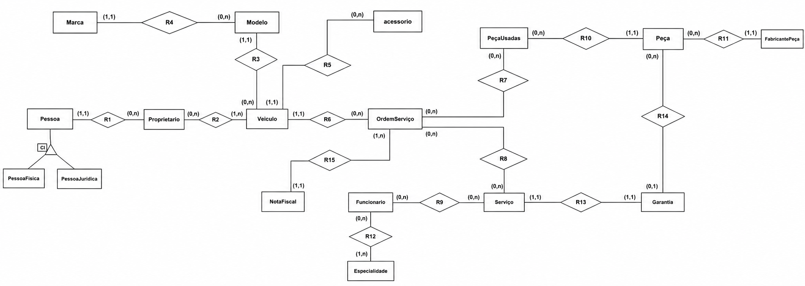

# Sistema de Gestão para Oficina Mecânica

Banco de dados relacional projetado para suportar operações completas de uma oficina mecânica, incluindo controle de clientes, veículos, ordens de serviço, estoque e faturamento.

O foco do projeto está em integridade referencial, normalização (até 3FN) e rastreabilidade operacional, simulando um ambiente real de gestão automotiva.

---

## ✨ Funcionalidades

* **Cadastro de clientes (PF/PJ):** Estrutura unificada com validação de identidade e dados de contato.
* **Gestão de veículos:** Histórico completo de propriedade, características e manutenção.
* **Controle de funcionários:** Gerenciamento do corpo técnico segmentado por especialidades operacionais.
* **Fluxo de Ordem de Serviço (OS):** Controle de status, datas de entrada/saída e faturamento.
* **Gestão de estoque e peças:** Rastreamento de consumo de peças novas e usadas diretamente vinculadas à OS.
* **Faturamento integrado:** Emissão e vínculo de Notas Fiscais diretamente às Ordens de Serviço executadas.
* **Garantia pós-venda:** Rastreabilidade de prazos e coberturas vinculadas aos serviços prestados.

---

## 📐 Modelo Conceitual & Lógico

Projeto estruturado com modelagem relacional consistente e foco em escalabilidade lógica.

### Conceitos aplicados
* Normalização até 3ª Forma Normal (3FN).
* Especialização de entidades (`Pessoa` → `PessoaFisica` / `PessoaJuridica`).
* Resolução de relacionamentos N:M via tabelas associativas.
* Histórico de propriedade de veículos para fins de auditoria.

### 🖼️ Diagrama de Entidade-Relacionamento (DER)



### 🧩 Modelo Lógico

> [!TIP]
> Pessoa (**CPF_CNPJ**, nomeCompleto, CEP, complemento, logradouro, email1, email2, ddi, ddd, numero, tipoPessoa)
> 
> PessoaFisica (**CPF_CNPJ**, dataNascimento)  
> 	↳ CPF_CNPJ referencia Pessoa
> 
> PessoaJuridica (**CPF_CNPJ**, inscricaoEstadual, contato)  
>   ↳ CPF_CNPJ referencia Pessoa
> 
> Proprietario (**idProprietario**, CPF_CNPJ, dataInicio, dataFim)  
>   ↳ CPF_CNPJ referencia Pessoa
> 
> Marca (**idMarca**, nomeMarca, descricao)
> 
> Modelo (**idModelo**, nomeModelo, descricao, idMarca)  
>   ↳ idMarca referencia Marca
> 
> Veiculo (**Placa**, chassi, Kilometragem, anoFabricacao, anoModelo, idProprietario, idModelo)  
>   ↳ idProprietario referencia Proprietario  
>   ↳ idModelo referencia Modelo
> 
> Acessorio (**idAcessorio**, descricao, placa)  
>   ↳ placa referencia Veiculo
> 
> Fabricante (**idFabricantePeca**, emailFabricantePeca, telefoneFabricantePeca)
> 
> Peca (**idPeca**, valorUnitario, descricao, nomePeca, quantidadePeca, idFabricante, idGarantia)  
>   ↳ idFabricante referencia Fabricante  
>   ↳ idGarantia referencia Garantia
> 
> PecaUsadas (**idPeca**, valorUnitario, descricao, nomePeca, quantidadePeca, idFabricante, idOS)  
>   ↳ idFabricante referencia Fabricante  
>   ↳ idOS referencia OrdemServico
> 
> OrdemServico (**idOS**, dataEntrada, dataSaida, status, valorPago, placa)  
>   ↳ placa referencia Veiculo
> 
> Servico (**idServico**, descricao, precoServico, idOS, cpfFuncionario)  
>   ↳ idOS referencia OrdemServico  
>   ↳ cpfFuncionario referencia Funcionario
> 
> Especialidade (**idEspecialidade**, descricao, tipoEspecialidade)
> 
> Funcionario (**CpfFuncionario**, nomeFuncionario, emailFuncionario, telefoneFuncionario, idEspecialidade)  
>   ↳ idEspecialidade referencia Especialidade
> 
> Garantia (**idGarantia**, idServico, dataInicio, dataFim)  
>   ↳ idServico referencia Servico
> 
> NotaFiscal (**idNotaFiscal**, dataEmissao, idOs)  
>   ↳ idos referencia OrdemServico

---

## 🏗️ Implementação (PostgreSQL)

O banco de dados foi construído utilizando recursos nativos do PostgreSQL para garantir a consistência dos dados de ponta a ponta:
* `PRIMARY KEY` e `FOREIGN KEY` para garantir a integridade referencial rigorosa.
* `NOT NULL` para assegurar a obrigatoriedade de preenchimento em campos críticos de domínio.
* `CHECK` para validações personalizadas de regras de negócio em nível de banco.
* `SERIAL` para geração automática e sequencial de chaves primárias.

---

## 📋 Dicionário de Dados (Resumo Operacional)

<table>
  <thead>
    <tr>
      <th align="left">Tabela</th>
      <th align="left">Função Operacional no Sistema</th>
    </tr>
  </thead>
  <tbody>
    <tr>
      <td><b>Pessoa</b></td>
      <td>Entidade base abstrata para centralização de dados cadastrais (PF/PJ).</td>
    </tr>
    <tr>
      <td><b>PessoaFisica</b></td>
      <td>Extensão da entidade Pessoa contendo dados específicos de clientes CPF.</td>
    </tr>
    <tr>
      <td><b>PessoaJuridica</b></td>
      <td>Extensão da entidade Pessoa contendo dados específicos de clientes CNPJ.</td>
    </tr>
    <tr>
      <td><b>Veiculo</b></td>
      <td>Registro cadastral e características técnicas da frota sob manutenção.</td>
    </tr>
    <tr>
      <td><b>Proprietario</b></td>
      <td>Tabela de histórico de posse para rastreio de transição de donos de veículos.</td>
    </tr>
    <tr>
      <td><b>OrdemServico</b></td>
      <td>Núcleo operacional; registra fluxo, prazos e custos do atendimento.</td>
    </tr>
    <tr>
      <td><b>Servico</b></td>
      <td>Catálogo de procedimentos executados em cada ordem de serviço aberta.</td>
    </tr>
    <tr>
      <td><b>Peca</b></td>
      <td>Controle de estoque centralizado de novos componentes físicos disponíveis.</td>
    </tr>
    <tr>
      <td><b>PecaUsadas</b></td>
      <td>Rastreamento de consumo e aplicação física de peças atreladas à OS.</td>
    </tr>
    <tr>
      <td><b>Funcionario</b></td>
      <td>Cadastro do corpo técnico e administrativo responsável pela oficina.</td>
    </tr>
    <tr>
      <td><b>Especialidade</b></td>
      <td>Segmentação técnica para distribuição adequada de ordens de trabalho.</td>
    </tr>
    <tr>
      <td><b>NotaFiscal</b></td>
      <td>Registro contábil e fiscal exigido para o fechamento financeiro da OS.</td>
    </tr>
    <tr>
      <td><b>Garantia</b></td>
      <td>Regras, prazos e controle de cobertura de pós-venda para serviços prestados.</td>
    </tr>
    <tr>
      <td><b>Fabricante</b></td>
      <td>Mapeamento da origem, marcas e canais de contato de fornecedores de peças.</td>
    </tr>
  </tbody>
</table>

---

## 🚀 Tecnologias

* **PostgreSQL** (SGBD Relacional)
* **SQL** (DDL / DML)

---

## 📂 Estrutura do Projeto

```text
sistema-oficina-sql/
├── assets/
│   └── der.jpg
├── sql/
│   └── oficina.sql
└── README.md
````

## ▶️ Instruções de Execução

### 1. Clonar o repositório

Bash

```
git clone [https://github.com/nikorvich/sistema-oficina-sql.git](https://github.com/nikorvich/sistema-oficina-sql.git)
cd sistema-oficina-sql
```

### 2. Criar o banco de dados local

Bash

```
createdb oficina
# Ou alternativamente via psql CLI:
psql -U postgres -c "CREATE DATABASE oficina;"
```

### 3. Executar o script estrutural

Bash

```
psql -U postgres -d oficina -f sql/oficina.sql
```
